# Pipeline CAPES-DOI

Pipeline para enriquecimento de dados bibliográficos da CAPES com identificadores DOI através da API Crossref.

## Visão Geral

Este projeto implementa um pipeline assíncrono para obter Digital Object Identifiers (DOI) de artigos científicos brasileiros através da integração entre dados da CAPES e a base Crossref. O sistema utiliza algoritmos de similaridade fuzzy para fazer o matching entre títulos e possui otimizações como cache, checkpoints e rate limiting.

**Métricas do Piloto:**
- 10.000 registros processados em 44 minutos
- 3.301 DOIs encontrados (33% de taxa de sucesso)
- Velocidade: 3.8 registros/segundo

## Arquitetura

```mermaid
flowchart TD
    %% Fontes de Dados
    A1[CAPES Parte 1<br/>CSV - ISO-8859-1] --> B1[Carregamento<br/>de Dados]
    A2[CAPES Parte 2<br/>CSV - ISO-8859-1] --> B1
    
    %% Processamento Inicial
    B1 --> B2[Concatenação<br/>dos Datasets]
    B2 --> B3{Verificar<br/>Checkpoint?}
    
    %% Sistema de Cache e Checkpoint
    C1[(Cache SQLite<br/>crossref_cache<br/>processing_progress)] --> B3
    B3 -->|Existe| B4[Carregar do<br/>Checkpoint]
    B3 -->|Não existe| B5[Processar do Zero]
    
    %% Amostragem Estratificada
    B4 --> D1[Amostragem Estratificada<br/>por AN_BASE - Anos]
    B5 --> D1
    
    %% Filtros e Validação
    D1 --> E1[Aplicar Filtros<br/>Skip Patterns]
    E1 --> E2[Normalização<br/>de Títulos]
    E2 --> E3[Validação de<br/>Comprimento e Padrões]
    
    %% Processamento em Lotes
    E3 --> F1[Divisão em Lotes<br/>200 registros/lote]
    
    %% Cache Lookup
    F1 --> G1{Buscar no<br/>Cache Local}
    G1 -->|Encontrado| G2[Resultado<br/>do Cache]
    G1 -->|Não encontrado| G3[Preparar para<br/>API Crossref]
    
    %% Controles de Concorrência
    G3 --> H1[Semáforo<br/>50 requisições concorrentes]
    H1 --> H2[Rate Limiting<br/>80 req/s]
    
    %% API Crossref
    H2 --> I1[API Crossref<br/>search.crossref.org]
    I1 --> I2[Busca por Título<br/>query.title - max 100 chars]
    I2 --> I3[Retorno: DOI + título<br/>máximo 3 resultados]
    
    %% Fuzzy Matching
    I3 --> J1[Fuzzy Matching<br/>RapidFuzz token_sort_ratio]
    J1 --> J2{Similaridade<br/>>= 90%?}
    J2 -->|Sim| J3[Match Válido<br/>DOI + Score]
    J2 -->|Não| J4[Sem Match<br/>NULL]
    
    %% Armazenamento de Resultados
    G2 --> K1[Consolidar<br/>Resultados do Lote]
    J3 --> K2[Salvar no Cache<br/>SQLite]
    J4 --> K2
    K2 --> K1
    
    %% Checkpoints Incrementais
    K1 --> L1{Intervalo de<br/>Checkpoint<br/>1000 registros?}
    L1 -->|Sim| L2[Salvar Checkpoint<br/>Parquet + Progresso]
    L1 -->|Não| L3[Continuar<br/>Processamento]
    L2 --> M1[(Armazenamento<br/>Checkpoint<br/>data/processed/)]
    
    %% Controle de Fluxo
    L3 --> N1{Mais lotes<br/>para processar?}
    N1 -->|Sim| F1
    N1 -->|Não| O1[Consolidação Final]
    
    %% Resultado Final
    O1 --> O2[Combinar Dados<br/>Processados + Novos]
    O2 --> P1[Salvar Resultado Final<br/>capes_enriched_final.parquet]
    P1 --> P2[(Dados Enriquecidos<br/>data/enriched/)]
    
    %% Logs e Monitoramento
    K1 --> Q1[Logs de Progresso<br/>enrichment_final.log]
    P1 --> Q2[Métricas Finais<br/>Taxa Sucesso, Velocidade, DOIs]
    
    %% Tratamento de Erros
    I1 -.->|Timeout/429| R1[Tratamento de Erro<br/>Sleep + Retry]
    R1 -.-> H2
    
    %% Estilização
    classDef dataSource fill:#e1f5fe
    classDef processing fill:#f3e5f5
    classDef storage fill:#e8f5e8
    classDef api fill:#fff3e0
    classDef control fill:#fce4ec
    
    class A1,A2 dataSource
    class B1,B2,D1,E1,E2,E3,F1,O1,O2 processing
    class C1,M1,P2 storage
    class I1,I2,I3 api
    class H1,H2,L1,L2,G1,J2,N1 control
```



### Componentes Principais

- **Cache SQLite**: Evita reprocessamento de títulos já consultados
- **Rate Limiting**: Respeita limites da API Crossref (80 req/min)
- **Checkpoints**: Salvamento incremental a cada 1.000 registros
- **Processamento Assíncrono**: 50 conexões concorrentes
- **Algoritmo Fuzzy**: rapidfuzz token_sort_ratio com threshold 90%
- **Amostragem Estratificada**: Distribuição equilibrada por ano

## Pré-requisitos

- Python 3.8+
- Conexão com internet (para API Crossref)
- ~2GB de espaço em disco (para dados e cache)
- Memória RAM: Mínimo 4GB recomendado

## Instalação

### 1. Clonar o repositório
```bash
git clone https://github.com/arturbersan/vertigo-processo-seletivo/
cd vertigo-processo-seletivo
```

### 2. Criar ambiente virtual
```bash
python -m venv venv
source venv/bin/activate  # Linux/Mac
# ou
venv\Scripts\activate     # Windows
```

### 3. Instalar dependências
```bash
pip install -r requirements.txt
```

### 4. Criar estrutura de pastas
```bash
mkdir -p data/raw
```

## Configuração dos Dados

### 1. Download dos dados CAPES
Os arquivos de dados não estão incluídos no repositório devido ao tamanho (~500MB total). Use o script automatizado:

```bash
python download_data.py
```

Este script irá:
- Criar a estrutura de pastas necessária
- Baixar os 2 arquivos CSV da CAPES automaticamente
- Colocá-los na pasta `data/raw/` com os nomes corretos
- Mostrar progresso do download

**Arquivos baixados:**
- `data/raw/capes_parte1.csv` (br-capes-colsucup-producao-2017a2020 - Parte 1)
- `data/raw/capes_parte2.csv` (br-capes-colsucup-producao-2017a2020 - Parte 2)

**Download manual (alternativo):**
Se preferir baixar manualmente:

```bash
# Criar pastas
mkdir -p data/raw

# Baixar Parte 1
wget "https://dadosabertos.capes.gov.br/dataset/589e8182-71e3-4669-b47a-3f8ecf1a16ab/resource/25020945-8050-4922-92f0-606c0eb45e7b/download/br-capes-colsucup-producao-2017a2020-2023-11-30-bibliografica-artpe_parte1.csv" -O data/raw/capes_parte1.csv

# Baixar Parte 2  
wget "https://dadosabertos.capes.gov.br/dataset/589e8182-71e3-4669-b47a-3f8ecf1a16ab/resource/209740e3-2e6e-4c5f-a705-7566bd7276c0/download/br-capes-colsucup-producao-2017a2020-2023-11-30-bibliografica-artpe_parte2.csv" -O data/raw/capes_parte2.csv
```

### 2. Verificar download bem-sucedido
```
data/
├── raw/
│   ├── capes_parte1.csv    # Dados CAPES Parte 1
│   └── capes_parte2.csv    # Dados CAPES Parte 2
├── processed/              # Checkpoints automáticos
└── enriched/              # Resultados finais
```

## Como Usar

### Execução Básica
```bash
# Processar 10.000 registros (padrão)
python pipeline_with_resume.py

# Processar quantidade específica
python pipeline_with_resume.py 50000

```

### Geração de Gráficos
```bash
# Gerar gráficos para apresentação
python generate_capes_graphics.py
```

### Criar Amostra para Análise
```bash
# Criar amostra estratificada de 300 registros
python create_sample_dataset.py
```

## Estrutura do Projeto

```
vertigo-processo-seletivo/
├── pipeline_with_resume.py    # Script principal do pipeline
├── generate_capes_graphics.py # Gerador de gráficos
├── create_sample_dataset.py   # Criador de amostras
├── test_pipeline.py          # Testes do pipeline
├── requirements.txt          # Dependências Python
├── README.md                # Documentação
├── data/
│   ├── raw/                 # Dados originais CAPES
│   ├── processed/           # Checkpoints e cache
│   └── enriched/           # Resultados finais
├── logs/                   # Logs de execução
├── output/                 # Gráficos gerados
└── venv/                   # Ambiente virtual Python
```

## Monitoramento

### Logs de Execução
```bash
# Acompanhar progresso em tempo real
tail -f logs/enrichment_final.log
```

### Métricas Importantes
- **Taxa de sucesso**: Percentual de DOIs encontrados
- **Velocidade**: Registros processados por segundo
- **Cache hits**: Eficiência do sistema de cache
- **Checkpoints**: Progresso salvo incrementalmente

### Exemplo de Output
```
Resultados finais:
Tempo: 44.0 minutos
Processados: 10,000
DOIs encontrados: 3,301
Taxa de sucesso: 33.0%
Velocidade: 3.8 reg/seg
```

## Outputs Gerados

### Dados Enriquecidos
- **Localização**: `data/enriched/capes_enriched_{size}_final.parquet`
- **Formato**: Apache Parquet (otimizado para análise)
- **Colunas adicionadas**:
  - `doi`: Digital Object Identifier encontrado
  - `crossref_title`: Título encontrado no Crossref
  - `similarity_score`: Score de similaridade (0-100)
  - `from_cache`: Indica se resultado veio do cache

### Gráficos para Apresentação
- **Localização**: `output/`
- **Arquivos**:
  - `grafico_1_taxa_sucesso.png`: Taxa geral de sucesso
  - `grafico_2_top_programas.png`: Top programas por DOIs
  - `grafico_3_similarity_scores.png`: Distribuição de scores

### Cache e Checkpoints
- **Cache**: `data/processed/cache.db` (SQLite)
- **Checkpoints**: `data/processed/checkpoint_{size}_{progress}.parquet`
- **Progresso**: Registrado na tabela `processing_progress`

## Troubleshooting

### Problemas Comuns

#### 1. Erro de Encoding
```bash
# Se houver problemas com caracteres especiais
export PYTHONIOENCODING=utf-8
```

#### 2. Rate Limiting da API
```bash
# O pipeline já trata automaticamente, mas se houver muitos 429:
# - Verifique conexão de internet
# - O sistema fará retry automático
```

#### 3. Interrupção do Processamento
```bash
# O pipeline retoma automaticamente do último checkpoint
python pipeline_with_resume.py <mesmo_target_size>
```

#### 4. Limpeza de Cache
```bash
# Se necessário resetar o cache
rm data/processed/cache.db
rm data/processed/checkpoint_*.parquet
```

### Verificação de Logs
```bash
# Verificar erros específicos
grep "ERROR" logs/enrichment_final.log

# Verificar progresso
grep "Progresso" logs/enrichment_final.log
```

## Configurações Avançadas

### Parâmetros do Pipeline (no código)
- `max_concurrent`: 50 conexões simultâneas
- `rate_limit`: 80 requisições/minuto
- `similarity_threshold`: 90% mínimo
- `batch_size`: 200 registros por lote
- `checkpoint_interval`: 1000 registros

### Filtros de Título
O sistema ignora automaticamente:
- Títulos muito curtos (< 5 caracteres)
- Títulos muito longos (> 250 caracteres)
- Títulos só com números
- Títulos só com maiúsculas longas

## Performance

### Recursos Necessários
- **CPU**: 2+ cores recomendado
- **RAM**: 4GB mínimo, 8GB recomendado
- **Disk**: SSD recomendado para melhor performance
- **Network**: Conexão estável para API calls

### Otimizações Implementadas
- Cache SQLite para evitar consultas repetidas
- Processamento assíncrono com controle de concorrência
- Rate limiting inteligente
- Checkpoints incrementais
- Amostragem estratificada

## Próximos Passos

### Melhorias Planejadas
1. **Integração SciELO**: Adicionar base brasileira
2. **Pré-processamento avançado**: Normalização de acentos
3. **Busca multi-etapa**: Fallback por palavras-chave
4. **Dashboard web**: Interface para monitoramento
5. **API interna**: Serviço para uso institucional

### Extensões Possíveis
- Integração com outras bases (DOAJ, PubMed)
- Busca por autor quando disponível
- Machine Learning para otimizar estratégias
- Pipeline em tempo real para novos dados


**Nota**: Este projeto foi desenvolvido para fins acadêmicos e de pesquisa, respeitando os termos de uso da API Crossref e dos dados abertos da CAPES.
